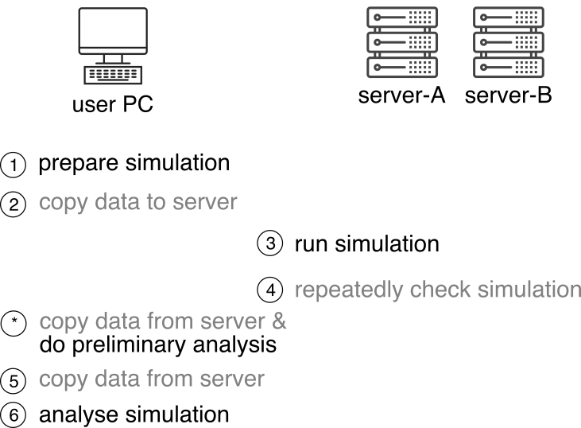

.. image:: https://img.shields.io/travis/com/sizmailov/remote-runner/master.svg?logo=travis
    :alt: master status
    :target: https://travis-ci.com/sizmailov/remote-runner

..  .. image:: https://img.shields.io/pypi/v/remote-runner.svg?logo=PyPI&logoColor=white
        :alt: pypi package
        :target: https://pypi.org/project/remote-runner/

.. image:: https://codecov.io/gh/sizmailov/remote-runner/branch/master/graph/badge.svg
  :alt: coverage
  :target: https://codecov.io/gh/sizmailov/remote-runner

The library targets the following use case:

User prepares number of tasks on local machine and executes
them remotely. The library aims to automate routine copying and execution
steps of this workflow.

    Target workflow scheme. Routine steps (in grey) are  automated

